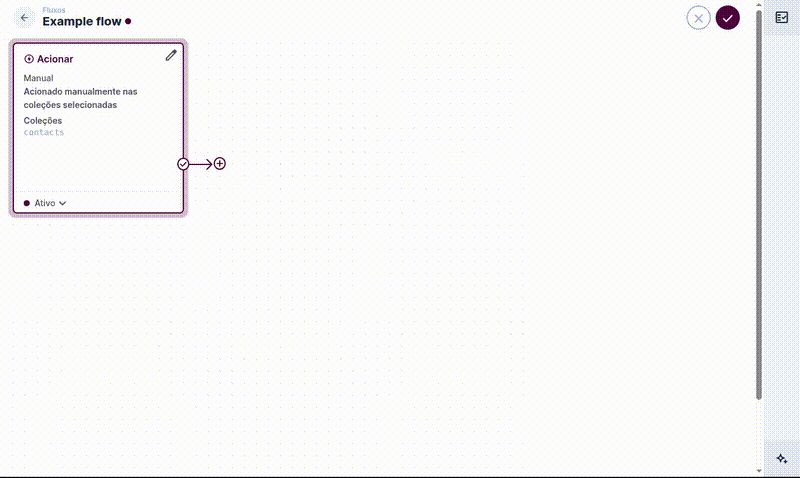

# Phone Parser for Directus

A Directus Flow operation that parses and validates international phone numbers. Uses [libphonenumber-js](https://www.npmjs.com/package/libphonenumber-js) to extract country code, country, and national number from any E.164-formatted phone number.



## Features

- Parses international phone numbers in E.164 format (e.g. `+5531988884444`)
- Returns country code, country ISO, and national number
- Validates phone number correctness via libphonenumber-js
- Returns structured error output for invalid or missing input
- Works in any Directus Flow as a custom operation

## Installation

### Via Directus Marketplace (Recommended)

1. Navigate to your Directus project
2. Go to **Settings** → **Extensions**
3. Search for "**Phone Parser**"
4. Click **Install**

### Via npm

```bash
npm install @ribertec/directus-extension-phone-parser
```

Then restart your Directus instance.

## Usage

Add the **Phone Parser** operation to any Directus Flow.

### Input

| Field   | Description                                                                            |
| ------- | -------------------------------------------------------------------------------------- |
| `phone` | Phone number in E.164 format. Must start with `+` followed by country code and number. |

**Example input:** `+5531988884444`

### Output

On success:

```json
{
  "input": "+5531988884444",
  "country": "BR",
  "countryCode": "+55",
  "nationalNumber": "31988884444",
  "valid": true
}
```

On failure:

```json
{
  "success": false,
  "error": "Phone number must start with +"
}
```

## Requirements

- Directus 10.10.0 or higher
- Phone number must be provided in E.164 format (start with `+` and country code)

## License

MIT License — see [LICENSE](LICENSE) file for details
